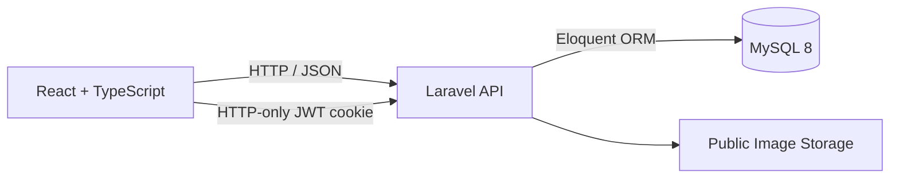

# Appifylab Full-Stack Assessment

A full-stack social feed application built for the Appifylab Full-Stack Engineer assessment.

The project converts the provided Login, Register, and Feed HTML/CSS pages into a functional React application backed by a Laravel API and MySQL database. The original design assets and layout structure are retained while the required authentication, posting, reaction, comment, reply, privacy, and pagination features are implemented.

## Submission Links

- **GitHub repository:** https://github.com/swannts/appifylab-full-stack-assessment
- **Video walkthrough:** Add the YouTube walkthrough URL before submission
- **Live application:** Add the deployed application URL if available

## Technology Stack

### Frontend

- React 18
- TypeScript
- Vite
- React Router
- Zod validation
- Bootstrap and the provided HTML/CSS design assets

### Backend

- PHP 8.3+
- Laravel 13
- Eloquent ORM
- Custom JWT authentication using an HTTP-only cookie
- Laravel Form Requests and API Resources

### Database and Development Environment

- MySQL 8
- Docker Compose
- PHPUnit

## Implemented Features

### Authentication and Authorization

- User registration with first name, last name, email, and password
- User login and logout
- Password hashing using Laravel's hashing service
- JWT authentication
- JWT stored in an HTTP-only cookie instead of browser local storage
- Protected feed route
- Authenticated profile endpoint
- Client-side and server-side validation

### Posts

- Create text-only posts
- Create image-only posts
- Create posts containing both text and an image
- Public and private visibility options
- Public posts are visible to authenticated users
- Private posts are returned only to their author in the feed
- Newest posts appear first
- Cursor-based feed pagination
- Manual refresh and load-more support

### Reactions

- Like and unlike posts
- Like and unlike comments
- Like and unlike replies
- Display the current user's reaction state
- Display reaction totals
- Display the users who liked a post, comment, or reply
- Prevent duplicate likes using database-level unique constraints

### Comments and Replies

- Create top-level comments
- Create one-level replies
- Prevent replies to replies
- Validate that a reply belongs to a comment from the same post
- Display comments newest first
- Display replies oldest first within their parent comment

### Image Uploads

- Upload JPEG, PNG, GIF, and WebP images
- Maximum image size of 5 MB
- Generate unique server-side file names
- Store the generated image URL with the post
- Display an image preview before publishing

## Architecture



The repository uses a monorepo structure:

```text
appifylab-full-stack-assessment/
├── backend/                 Laravel API
│   ├── app/
│   │   ├── Http/
│   │   │   ├── Controllers/
│   │   │   ├── Middleware/
│   │   │   ├── Requests/
│   │   │   └── Resources/
│   │   ├── Models/
│   │   ├── Services/
│   │   └── Traits/
│   ├── database/
│   │   ├── factories/
│   │   ├── migrations/
│   │   └── seeders/
│   ├── routes/
│   └── tests/
├── frontend/                React application
│   ├── public/
│   └── src/
│       ├── components/
│       ├── context/
│       ├── lib/
│       ├── pages/
│       ├── routes/
│       └── types/
├── docker/
├── docker-compose.yml
└── README.md
```

## Database Design

### Users

Stores account and authentication information.

Important columns:

- `id`
- `first_name`
- `last_name`
- `email`
- `password_hash`
- timestamps

### Posts

Stores public and private feed posts.

Important columns:

- `id`
- `author_id`
- `content`
- `image_url`
- `visibility`
- `likes_count`
- `comments_count`
- timestamps

Important indexes:

- `(visibility, created_at)`
- `(author_id, created_at)`

### Comments

Comments and replies share the same table. A reply has a non-null `parent_id` that references another comment.

Important columns:

- `id`
- `post_id`
- `author_id`
- `parent_id`
- `content`
- timestamps

Important indexes:

- `(post_id, parent_id, created_at)`
- `(parent_id, created_at)`
- `author_id`

### Post Likes

Represents the many-to-many relationship between users and liked posts.

A composite unique constraint on `(post_id, user_id)` prevents duplicate reactions.

### Comment Likes

Represents likes for both comments and replies.

A composite unique constraint on `(comment_id, user_id)` prevents duplicate reactions.

## Important Design Decisions

### HTTP-Only Authentication Cookie

The JWT is stored in an HTTP-only cookie. This prevents frontend JavaScript from directly reading the token and is safer than storing authentication tokens in local storage.

### Cursor Pagination

The feed uses cursor pagination rather than offset pagination. Offset pagination becomes increasingly expensive for deep pages because the database must scan and skip previous rows. Cursor pagination works better for a large, continuously growing feed.

Posts use a stable descending order:

```text
created_at DESC, id DESC
```

### Denormalized Counters

Posts store `likes_count` and `comments_count`. This avoids running full aggregate queries every time the feed is loaded.

### Transactional Like Toggling

Post-like operations run inside database transactions and use row locking. Database uniqueness constraints provide an additional layer of protection against duplicate reactions.

### Shared Comment Table

Top-level comments and replies have the same data shape, so they are stored in one table. This avoids duplicate schemas and keeps the relationship simple.

The application currently supports one reply level, matching the assessment scope.

### Image URLs Instead of Database Binaries

The database stores image URLs instead of binary image data. This keeps the relational database focused on structured data and reduces database storage and backup overhead.

## Getting Started with Docker

### Prerequisites

Install the following:

- Docker
- Docker Compose
- Node.js 22 and npm for preparing the current frontend development image
- Git

### 1. Clone the Repository

```bash
git clone https://github.com/swannts/appifylab-full-stack-assessment.git
cd appifylab-full-stack-assessment
```

### 2. Install Frontend Dependencies

The current development Dockerfile copies the frontend dependencies from the local build context.

```bash
cd frontend
npm ci
cd ..
```

### 3. Start the Containers

```bash
docker compose up --build -d
```

The services will be available at:

- Frontend: http://localhost:3000
- Backend API: http://localhost:8000
- MySQL: localhost:3306

### 4. Run Migrations and Seed the Database

```bash
docker compose exec backend php artisan migrate --seed
```

To completely recreate the development database:

```bash
docker compose exec backend php artisan migrate:fresh --seed
```

### 5. Open the Application

Visit:

```text
http://localhost:3000
```

## Seeded Test Accounts

All seeded users use the same password:

```text
Password123!
```

| User | Email |
|---|---|
| Alice Smith | `alice@example.com` |
| Bob Jones | `bob@example.com` |
| Charlie Brown | `charlie@example.com` |
| Dave Miller | `dave@example.com` |

Use multiple accounts to verify:

- Public post visibility
- Private post visibility
- Like and unlike state
- Comment and reply interactions
- Likes-list modals

## Useful Commands

### View Container Logs

```bash
docker compose logs -f
```

### View Backend Logs

```bash
docker compose logs -f backend
```

### View Frontend Logs

```bash
docker compose logs -f frontend
```

### Run Backend Tests

```bash
docker compose exec backend php artisan test
```

### Build the Frontend

```bash
docker compose exec frontend npm run build
```

### Access Laravel Tinker

```bash
docker compose exec backend php artisan tinker
```

### Stop the Application

```bash
docker compose down
```

### Stop and Remove the Database Volume

```bash
docker compose down -v
```

## API Endpoints

Authentication is handled through the HTTP-only `auth_token` cookie. The browser sends it automatically for authenticated requests.

### Authentication

| Method | Endpoint | Authentication | Description |
|---|---|---:|---|
| `POST` | `/api/auth/register` | No | Register and sign in a new user |
| `POST` | `/api/auth/login` | No | Sign in an existing user |
| `POST` | `/api/auth/logout` | Yes | Clear the authentication cookie |
| `GET` | `/api/auth/profile` | Yes | Get the authenticated user |

### Posts

| Method | Endpoint | Authentication | Description |
|---|---|---:|---|
| `GET` | `/api/posts` | Yes | Get the cursor-paginated feed |
| `POST` | `/api/posts` | Yes | Create a post |
| `POST` | `/api/posts/{id}/like` | Yes | Like or unlike a post |
| `GET` | `/api/posts/{id}/likes` | Yes | List users who liked a post |

Feed query parameters:

| Parameter | Default | Description |
|---|---:|---|
| `per_page` | `10` | Number of posts, limited to a maximum of 50 |
| `cursor` | — | Encoded cursor returned by the previous response |

Example feed request:

```http
GET /api/posts?per_page=10
```

The pagination response includes:

```json
{
  "pagination": {
    "next_cursor": "encoded-cursor-or-null",
    "has_more": true
  }
}
```

### Comments and Replies

| Method | Endpoint | Authentication | Description |
|---|---|---:|---|
| `POST` | `/api/posts/{postId}/comments` | Yes | Create a comment or reply |
| `POST` | `/api/comments/{id}/like` | Yes | Like or unlike a comment or reply |
| `GET` | `/api/comments/{id}/likes` | Yes | List users who liked a comment or reply |

Create a top-level comment:

```json
{
  "content": "Great post!"
}
```

Create a reply:

```json
{
  "content": "Thank you!",
  "parent_id": "parent-comment-id"
}
```

### Uploads

| Method | Endpoint | Authentication | Description |
|---|---|---:|---|
| `POST` | `/api/upload` | Yes | Upload an image using `multipart/form-data` |

Form field:

```text
image
```

## Validation Rules

### Registration

- First name is required
- Last name is required
- Email must be valid and unique
- Password is required and must contain at least six characters

### Post Creation

- A post must contain text, an image, or both
- `visibility` is required and must be boolean
- `image_url` must be a valid URL when supplied

### Comment Creation

- Comment content is required
- Content is trimmed before validation
- The parent comment must exist
- The parent comment must belong to the same post
- A reply cannot be created beneath another reply

### Image Upload

- Required image file
- JPEG, PNG, JPG, GIF, or WebP
- Maximum size: 5 MB

## Security Considerations

The implementation includes:

- Hashed passwords
- HTTP-only authentication cookie
- Signed JWTs with expiration
- Protected backend routes
- Protected frontend feed route
- Backend validation through Form Requests
- Database foreign keys
- Composite unique constraints for reactions
- Generic API error responses for unexpected exceptions
- File type and size validation

Before a production deployment, the following should also be completed:

- Enforce private-resource authorization on every post and comment interaction endpoint
- Use a dedicated authentication package such as Laravel Sanctum or a maintained JWT library
- Configure HTTPS-only cookies
- Configure explicit credentialed CORS origins
- Add authentication rate limiting
- Move application secrets out of committed development configuration
- Add automated security and authorization tests

## Performance and Scalability

The project includes several choices intended for a large feed:

- Cursor pagination for posts
- Indexed visibility and author feed queries
- Stable ordering using timestamps and IDs
- Eager loading to avoid basic N+1 queries
- `withCount` for viewer reaction state
- Denormalized post reaction and comment totals
- Database transactions and row locks for post reactions
- UUID-based identifiers

For a production workload with millions of reads, the next improvements would include:

- Cursor pagination for comments, replies, and likes lists
- Loading only a limited comment preview in the feed
- Redis caching for hot posts and counters
- Object storage and CDN delivery for images
- Queue-based image processing
- Read replicas
- Rate limiting and abuse prevention
- Observability with structured logging, metrics, tracing, and alerting

## Current Scope and Known Limitations

This repository focuses on the requested assessment features. It intentionally does not implement unrelated social-network functionality.

Current limitations include:

- Comments and replies are returned with the feed instead of being independently paginated
- Likes-list endpoints are not paginated
- Images are stored on the backend server's local public directory
- The repository currently contains only the default Laravel test examples
- Some visual controls inherited from the supplied design are decorative
- Production deployment configuration is not included

## Walkthrough Checklist

The assessment video should demonstrate:

1. User registration
2. User login and logout
3. Redirecting unauthenticated users away from the feed
4. Creating a text post
5. Uploading and publishing an image post
6. Creating public and private posts
7. Logging in as another account to verify private-post visibility
8. Liking and unliking a post
9. Opening the post likes list
10. Adding a comment
11. Adding a reply
12. Liking a comment and a reply
13. Opening comment and reply likes lists
14. Loading additional feed pages using cursor pagination
15. Reviewing the Laravel service, resource, validation, and database structure

## Assessment Scope

This project was built specifically around the requested requirements:

- React.js frontend
- Laravel backend
- MySQL database
- Login, registration, and protected feed
- Text and image posts
- Public and private visibility
- Likes, comments, replies, and reaction-user lists
- Security, performance, and scalable database considerations

---

Built for the Appifylab Full-Stack Engineer assessment.
